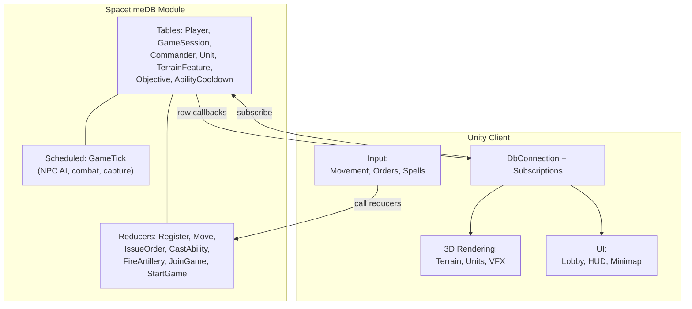

# Trench Valkyries: Sacrifice

An alternate-reality WW1 where magic has been woven into the fabric of warfare. Each faction's military has incorporated arcane forces alongside conventional arms, reshaping the battlefield.

## Game Concept

**Trench Valkyries: Sacrifice** is a slow-paced third-person multiplayer RPG. Players take on the role of **Commanders** -- officers who lead a squadron of NPC soldiers alongside fellow players. The prototype focuses on a single battle with a simple objective (point control or base destruction), with the long-term vision scaling up to a full theater of war.

### Core Pillars

- **Squad command** -- each player directs a group of NPC soldiers, issuing move, attack, and hold orders
- **Terrain matters** -- trenches block small arms fire, tunnels enable hidden flanking, and elevation changes the fight
- **Magic as a weapon of war** -- commanders wield spells that reshape terrain, heal squads, cloak movement, or rain destruction
- **Combined arms** -- infantry, magic, primitive tanks, and artillery all interact on the same battlefield

## Architecture

### How it works

1. The **SpacetimeDB module** (C#) defines all game state as tables and all mutations as reducers. A scheduled `GameTick` advances NPC AI, resolves combat, and updates objectives.
2. The **Unity client** connects via the SpacetimeDB C# SDK, subscribes to tables, and renders the world. Player input triggers reducer calls; table callbacks update the visual state.
3. All game logic runs server-side inside SpacetimeDB -- the client is a rendering and input layer.

## Tech Stack

| Layer | Technology |
|-------|-----------|
| Backend | [SpacetimeDB](https://spacetimedb.com) (C# module, .NET 8, WASI) |
| Client | Unity (C# with SpacetimeDB SDK) |
| Docs | Docusaurus (this site) |

## Learning Resources

- [SpacetimeDB Documentation](https://spacetimedb.com/docs)
- [SpacetimeDB Unity Guide](https://spacetimedb.com/docs/unity)
- Cursor rules in `.cursor/rules/` cover all C# SDK patterns used in this project
