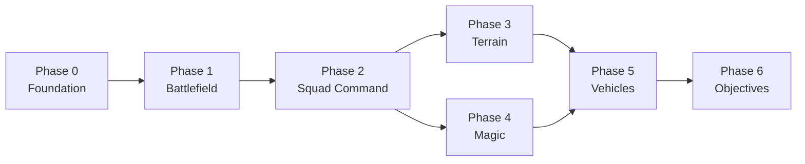

# Prototype Roadmap

The prototype is broken into 7 phases, each building on the last. Every phase has a **backend** half (SpacetimeDB module) and a **client** half (Unity) that can be worked in parallel once the schema is agreed on.

## Timeline

| Phase | Name | Timeframe | Focus |
|-------|------|-----------|-------|
| 0 | [Foundation](./phase-0-foundation.md) | Week 1 | Core schema, lobby, client connection |
| 1 | [The Battlefield](./phase-1-battlefield.md) | Weeks 2--3 | Spatial state, multiplayer movement |
| 2 | [Squad Command](./phase-2-squad-command.md) | Weeks 4--5 | NPC soldiers, orders, game tick |
| 3 | [Terrain + Trenches](./phase-3-terrain.md) | Weeks 6--7 | Cover, tunnels, line-of-sight |
| 4 | [Magic System](./phase-4-magic.md) | Weeks 8--9 | Abilities, mana, spell effects |
| 5 | [Vehicles + Artillery](./phase-5-vehicles.md) | Week 10 | Tanks, indirect fire |
| 6 | [Objectives + Win Condition](./phase-6-objectives.md) | Week 11 | Control points, match loop |

## How Phases Build on Each Other

- Phases 3 (Terrain) and 4 (Magic) can be developed in parallel after Phase 2
- Phase 5 (Vehicles) depends on both terrain and the combat system
- Phase 6 (Objectives) ties everything into a playable match loop

## Suggested Team Split

| Role | Phases | What they touch |
|------|--------|----------------|
| Backend dev(s) | 0A, 1A, 2A, 3A, 4A, 5A, 6A | C# in the SpacetimeDB module -- tables, reducers, game tick logic |
| Client/Unity dev(s) | 0B, 1B, 2B, 3B, 4B, 5B, 6B | Unity scenes, UI, 3D rendering, input handling |
| Overlap | All phases | Binding generation, schema reviews, playtesting |

Each phase doc below lists the backend and client tasks separately so the two tracks can coordinate on schema then work independently.

## Data Flow

Every feature follows the same pattern through SpacetimeDB:

1. **Backend** defines a table to store the state
2. **Backend** defines reducer(s) to mutate the state
3. **Client** subscribes to the table to receive updates
4. **Client** calls reducers from UI/input to trigger mutations
5. **Client** renders the table data in the game world

This pattern repeats for every new system -- lobby, movement, combat, spells, objectives.
