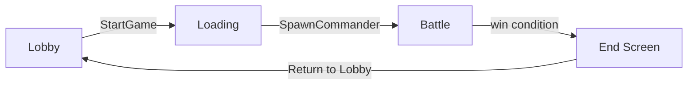

# Phase 6 -- Objectives + Win Condition (Week 11)

**Goal:** Tie everything together into a playable match loop with clear objectives and a victory screen.

**Dependencies:** All prior phases. This is the integration phase.

---

## Backend Tasks (6A)

### Tables

**Objective**
- `ulong` auto-increment primary key
- `ulong` game session ID (indexed)
- Objective type enum: `ControlPoint`, `BaseDestruction`
- Position (x, y, z)
- `float` radius
- Owning faction (nullable -- starts neutral for control points)
- `float` capture progress (0.0 to 1.0)

**MatchStats**
- `ulong` auto-increment primary key
- `ulong` game session ID
- `Identity` player identity
- `uint` kills, deaths, spells cast, objectives captured

### Objective mechanics

**Control point:**
1. Each game tick, count friendly vs. enemy units within the objective's radius
2. If only one faction has units present, increment capture progress toward that faction
3. If contested (both factions present), progress is frozen
4. When progress reaches 1.0, the faction captures the point
5. Win condition: hold all control points for a continuous duration, or hold majority when timer expires

**Base destruction:**
1. Each faction has a base objective with a large health pool
2. Units and vehicles within range deal damage to the enemy base
3. When a base's health reaches zero, that faction loses

### Reducers

| Reducer | Parameters | Behavior |
|---------|-----------|----------|
| `EndGame` | `ulong gameId, byte winningFaction` | Called by the game tick when a win condition is met; set `GameSession.State = Ended`; freeze all further actions |

### Game tick additions

- Check objective capture progress each tick
- Evaluate win conditions
- Record kill/death events in `MatchStats` (update existing rows or insert)
- When win condition met, call `EndGame` internally

### Post-match

- After `EndGame`, all reducers that modify game state reject calls for that session
- `MatchStats` rows remain readable for the post-match screen
- Players can return to lobby (their `GamePlayer` rows are cleaned up)

### Schema sketch

```csharp
[SpacetimeDB.Type]
public enum ObjectiveType : byte { ControlPoint, BaseDestruction }

[SpacetimeDB.Table(Accessor = "Objective", Public = true)]
[SpacetimeDB.Index.BTree(Accessor = "by_game_obj", Columns = new[] { "GameId" })]
public partial struct Objective
{
    [SpacetimeDB.PrimaryKey]
    [SpacetimeDB.AutoInc]
    public ulong Id;

    public ulong GameId;
    public ObjectiveType Type;
    public float X;
    public float Y;
    public float Z;
    public float Radius;
    public byte? OwningFaction;
    public float CaptureProgress;
}

[SpacetimeDB.Table(Accessor = "MatchStats", Public = true)]
[SpacetimeDB.Index.BTree(Accessor = "by_game_stats", Columns = new[] { "GameId" })]
public partial struct MatchStats
{
    [SpacetimeDB.PrimaryKey]
    [SpacetimeDB.AutoInc]
    public ulong Id;

    public ulong GameId;
    public Identity PlayerIdentity;
    public uint Kills;
    public uint Deaths;
    public uint SpellsCast;
    public uint ObjectivesCaptured;
}
```

---

## Client Tasks (6B)

### Objective visuals

- Control points: flag or banner at the position, circular capture ring on the ground
- Ring color transitions from neutral (gray) to faction color as capture progresses
- Base destruction: fortress or bunker model with visible damage states
- Pulsing highlight when a control point is being contested

### HUD

- Top-of-screen objective status bar showing all control points and their owners
- Match timer (if using timed win condition)
- Score summary: faction control point counts

### Victory / defeat screen

- Full-screen overlay when `GameSession.State` becomes `Ended`
- "Victory" or "Defeat" banner with faction theme
- Post-match stats table: kills, deaths, spells cast, objectives captured (from `MatchStats`)
- "Return to Lobby" button that cleans up and navigates back to the lobby UI

### Match flow

The complete loop:



1. **Lobby** -- players register, create/join games
2. **Loading** -- commanders and objectives spawn
3. **Battle** -- gameplay until win condition
4. **End screen** -- stats, then return to lobby

---

## Deliverable

A complete prototype match from lobby to victory screen. Players register, join a game, command squads through a battle with terrain, magic, and vehicles, compete for objectives, and see a results screen when a faction wins.
